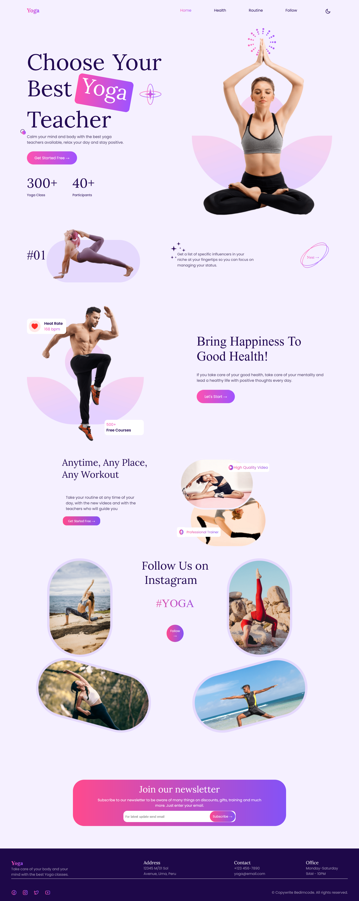
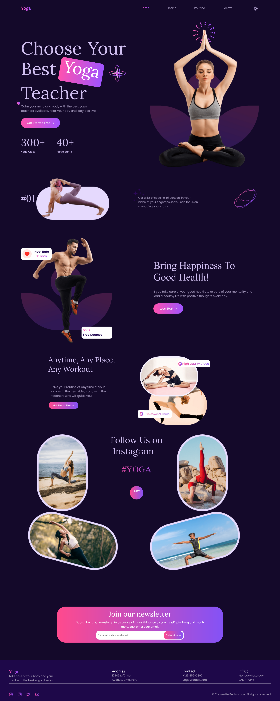
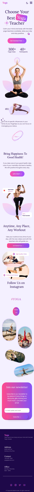
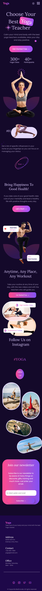

## Objective

Showcasing what we have learned about web development by recreating the website mockup. This mockup is for a single-page website that has responsive design with layouts for mobile and laptop/desktop. We use HTML and CSS only for switching between the Light and Dark mode.

## Team Member

Haruka (from header to "Bring Happiness To Good Health!" section)
Henrique (from "Anytime, Any Place, Any Workout" section to footer)

## Copy right

Designed by Young Kim.

Figma File:
https://www.figma.com/community/file/1229610063156797225

## Preview - PC Light Mode

## Preview - PC Dark Mode

## Preview - Mobile Light Mode

## Preview - MObile Dark Mode

